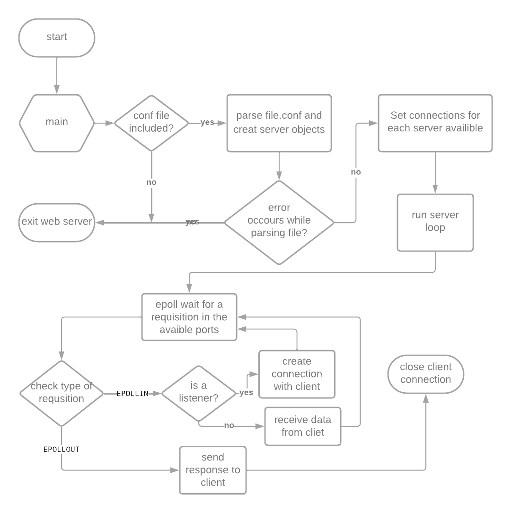

<p align="center">
  
  
</p>

# 42_webser

This is a project from 42 school where we create a ```weberver```.

## Index
- [About](#About)
- [Installation](#installation)
- [How to run](#how-to-run)
- [About file.conf](#about-fileconf)
	- [events block](#events-block)
	- [server block](#server-block)
	- [location Blocks](#location-blocks)
- [WebServer](#webserver)
	- [key functions](#key-functions)
	- [how a web server works](#how-a-web-server-works)
- [Project fluxogram](#project-fluxogram)
- [Dependencies](#dependencies)
- [References](#references)
- [Contributors](#🤝-contributors)

## About

The ```ft_webserv``` is a web server designed to work with the HTTP protocol, supporting GET, POST, and DELETE methods. It has been implemented using C++98, PHP 7.4 as CGI, and a Makefile for building and managing the project.

## Installation

To get started, first install PHP CGI version 7.4. Then, clone this repository into your local root directory and use the ```make``` command to compile the project.

## How to run

To run the web server, you'll need to create a configuration file (file.conf) and then execute the server using the command 
```./webserv file.conf```

## About file.conf

The ```web server``` configuration file is a critical component of your application's setup. It contains settings and rules for how incoming HTTP requests should be handled by the ```web server```.

The ```file.conf``` contains all the essential information required to configure the ```web server``` and handle incoming requests from various clients.

Below, you'll find concise explanations of each component used in this ```webserver``` configuration:


###	events Block

- ```events```: This block is used to configure global event-related settings for the web server. One important directive within this block is ```worker_connections```, which determines the maximum number of connections each worker process can handle simultaneously.

		# This is an example of an event block in WebServer configuration.

		events{
			worker_connections	10; ## Default: 1024
		}

### server Block

- ```server```: The server block defines the settings for a specific virtual server within ```web server```.

-	```listen```: Specifies the port on which the server will listen for incoming requests.

-	```root```: Sets the root directory from which files will be served for this `server block`.

-	```server_name```: Specifies the server's hostname or domain name.

-	```index```: Defines the order in which index files will be searched for when a directory is requested.

-	```proxy_buffer_size```: Sets the size of the buffer used for proxying requests.

-	```client_max_body_size```: Specifies the maximum allowed size for incoming request bodies.

-	```error_page```: Configures custom error pages for handling specific HTTP error codes, such as 405 (Method Not Allowed).

		# This is an example of a server block in WebServer configuration.
	
		server {
			listen 8080 default_server; # IPv4

			root	./server_root;

			server_name raoni_raoni;

			index index.php index.html;

			proxy_buffer_size		1024;

			client_max_body_size	2M;

			error_page 405		/error_405/index.html;
		}	

### location Blocks

-	```location```: Location blocks define rules for how requests to specific URI paths or patterns should be handled.

-	```allowed_methods```: Specifies the HTTP methods (e.g., `GET`, `POST`, `DELETE`) allowed for requests to this location.

-	```root```: Sets the directory from which files should be served for this location.

-	```redirects```: Configures redirection rules, which can be used to redirect requests to different URLs or locations.

-	```autoindex```: Determines whether autoindexing, which generates directory listings, is enabled or disabled for this location.

-	```cgi_pass```: Specifies the location or proxy pass for CGI scripts, often used for dynamic content generation.

		# This is an example of a location block in WebServer configuration.

		location /auto_index {
				autoindex	on;
				root ./server_root;
				index new.html new.php;
				allowed_methods GET POST;
		}


These components collectively define how the `web server`handles various aspects of incoming requests, including where to find resources, how to respond to specific errors, and how to route requests to different parts of your application. Understanding and configuring these elements correctly is crucial for the proper functioning of a ```web server``` and application.


## WebServer


A `web server` is a software application or hardware device that serves web content to users over the internet. Its primary function is to receive and respond to incoming HTTP (Hypertext Transfer Protocol) requests from web clients, such as web browsers or mobile devices. Web servers are a fundamental component of the World Wide Web and play a crucial role in delivering websites, web applications, and various online resources to users.
	
### key functions:
-	`Request Handling`: Web servers receive and process incoming HTTP requests, which can include requests for web pages, images, videos, and other web resources.

-	`Content Storage`: They store the files and data that make up a website or web application, often organized in directories or folders on the server's file system.

-	`Content Delivery`: Web servers retrieve requested content and send it as HTTP responses to the requesting clients, which can render the content in a web browser.

-	`Security`: Web servers can implement security measures, such as encryption (using HTTPS), access control, and firewall rules, to protect against unauthorized access and cyber threats.

-	`Logging`: They maintain access logs, recording details of each request, including the client's IP address, the requested resource, and the server's response, for monitoring and troubleshooting purposes.


###  how a web server works:

A web server works by handling HTTP requests and serving web content to clients (typically web browsers).
Here's a simplified overview of how a web server works:

-	The web server listens for incoming HTTP requests on a specified port (usually port 80 for HTTP or port 443 for HTTPS).
-	When a request arrives, the server parses the HTTP request, extracts the requested resource and HTTP method.
-	If the requested resource is a static file (e.g., HTML, CSS, images), the server locates the file on the server's file system and sends it as the HTTP response to the client.
-	If the request involves dynamic content (e.g., executing a CGI script), the server may execute the script, gather the script's output, and send it as the HTTP response.
-	If an error occurs during this process (e.g., the requested resource is not found), the server sends the appropriate HTTP error status code along with an error message in the response.

In summary, a web server uses HTTP, multiplexing, epoll (in some cases), CGI (for dynamic content), and HTTP status codes to efficiently handle and respond to client requests, delivering web content to users while managing errors and dynamic content generation.


-	`HTTP (Hypertext Transfer Protocol)`:`HTTP is the foundation of web communication. When a client, like a web browser, wants to retrieve a web page or resource, it sends an HTTP request to the web server. This request includes information about the desired resource and the HTTP method (GET, POST, etc.) to be used.

-	`Multiplexing`: Web servers often use multiplexing to efficiently handle multiple client connections concurrently. Multiplexing allows the server to manage multiple client requests within a single process or thread. This way, it can serve numerous clients simultaneously, improving performance and responsiveness.

-	`Epoll (Event Poll)`: Epoll is a system call in Linux that's commonly used by high-performance web servers to efficiently handle events, such as incoming connections or data ready for reading or writing. Epoll allows the server to register interest in specific events and efficiently wait for events to occur, reducing CPU and memory overhead.

-	`CGI (Common Gateway Interface)`: CGI is a protocol that enables web servers to execute external scripts or programs in response to HTTP requests. When a client requests dynamic content, the server may pass the request to a CGI script, which generates a dynamic response. For example, a web server can use CGI to execute a Python or PHP script to generate a dynamic web page.

-	`Error Codes`: Web servers handle errors using HTTP status codes. When something goes wrong, the server responds with an appropriate status code to inform the client of the issue. 	

	Common error codes include:

		404 Not Found: The requested resource does not exist.
		500 Internal Server Error: A generic server-side error occurred.
		405 Method Not Allowed: The HTTP method used is not supported for the requested resource.


## Project fluxogram
<p align="center">
  
</p>

## Dependencies
- PHP-CGI 7.4
- C++98 Compiler
 

## References

- [Nginx Documentation](https://nginx.org/en/docs/): Official documentation for the Nginx web server, providing in-depth information on configuration and usage.

- [HTTP Status Codes on MDN](https://developer.mozilla.org/en-US/docs/Web/HTTP/Status): A comprehensive guide to HTTP status codes, including their meanings and usage, maintained by Mozilla Developer Network.

- [PHP Documentation](https://www.php.net/docs.php): Official documentation for the PHP programming language, offering detailed information on functions, classes, and usage.

- [Linux epoll(7) Manual Page](https://man7.org/linux/man-pages/man7/epoll.7.html): The manual page for the epoll event handling mechanism in Linux, providing technical details and usage examples.


## 🤝 Contributors

The collab:

<table>
  <tr>
    <td>
      <a href="https://github.com/faustofaggion">
        <br>
        <sub><b>Fausto Faggion</b></sub>
      </a>
    </td>
    <td>
      <a href="https://github.com/LacrouxRaoni">
        <br>
        <sub><b>Raoni Lacroux</b></sub>
      </a>
    </td>

</table>
